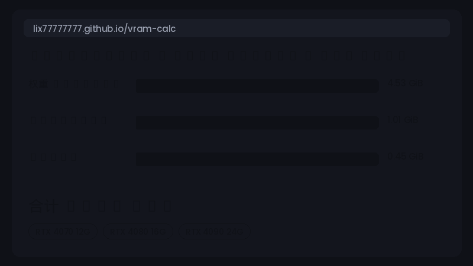

# vram-calc

> **我的显卡能不能跑这个模型？** —— 一个公式从头推导、并经**真实 GPU 实测校准**的
> LLM 显存计算器（30 项对照，最大误差 4%，含样本外验证）。

[](https://github.com/lix77777777/vram-calc/actions/workflows/ci.yml)
[](LICENSE)

**🔗 在线计算器：https://lix77777777.github.io/vram-calc/** （免安装，手机可用，中英切换）

[English README](README.md)



## 为什么又造一个显存计算器？

别的计算器靠猜，这个靠测。本项目每条公式都和 `torch.cuda` 实测对过账——
而且第一版推导**错了 41%~78%**，错的地方恰恰是多数博客不会告诉你的：

- **量化模型比"参数量×0.5字节"大得多**——bitsandbytes 只量化 Linear 层，
  embedding 保持 BF16（Qwen2.5-0.5B 里占 28%）
- **经典激活值公式漏了 logits/loss 链**——15 万词表下约 3·B·s·V 字节，比好几层激活还大
- **peft 默认把 LoRA adapter 建成 FP32**，梯度也是 FP32
- **裸 torch 的 BF16 训练是第三种记账**——AdamW 的 m/v 跟随参数 dtype（4 字节/参数），
  既不是 AMP 的 8 也不是 Megatron 的 12

完整推导见 [docs/formulas.md](docs/formulas.md)，实测协议与结果见
[docs/validation_report.md](docs/validation_report.md)。零基础也能看懂的讲义在
[docs/study_guide.md](docs/study_guide.md)。

## 快速开始（Python）

```bash
pip install git+https://github.com/lix77777777/vram-calc.git
```

```python
from vram_calc import estimate_training, estimate_inference, get_model, recommend, GiB

m = get_model("llama-3-8b")

bd = estimate_inference(m, batch=1, seq=8192)
print(bd.table())             # 权重 / KV-Cache / 激活 / 开销 / 合计
print(recommend(bd.total))    # 能跑的显卡列表

bd = estimate_training(m, mode="qlora", batch=2, seq=2048,
                       attn_impl="sdpa", gradient_checkpointing=True)
print(f"{bd.total / GiB:.1f} GiB")
```

零运行时依赖（torch 只在 validation 脚本里用）。

## 速查表（每参数字节数）

| 场景 | 权重 | 梯度 | 优化器(AdamW) | 静态合计 |
|---|---|---|---|---|
| 推理 FP16 | 2 | — | — | **2** |
| 推理 INT4 (NF4+DQ) | Linear≈0.52 + embed×2 | — | — | |
| 训练 AMP（参数 FP32） | 4 | 4 | 8 | **16** |
| 训练 Megatron/DeepSpeed BF16 | 2 | 2 | 12（含 FP32 master） | **16** |
| 训练 裸 torch BF16 ✓实测 | 2 | 2 | 4 | **8** |
| LoRA/QLoRA（peft，FP32 adapter） | 基座 + 4×P_lora | 4×P_lora | 8×P_lora | |

另加激活值 `L·s·B·h·(31 + 8f/h [+6as/h 若 eager]) + 3·B·s·V` 和
KV-Cache `2·L·n_kv·d_head·s·B·b`，详见 [docs/formulas.md](docs/formulas.md) §4–5。

## GGUF / Ollama（0.3 新增）

`estimate_gguf(model, quant="Q4_K_M", ctx=8192)` 估算 llama.cpp/Ollama 路径的显存
（按量化档位 bpw 算权重 + KV-Cache + 计算图缓冲）。权重项与官方 GGUF 文件大小
偏差约 1%；其余项**尚未上卡实测**——见下方验证矩阵，欢迎补充实测。

## 社区验证矩阵

| GPU | 环境 | 场景 | 最大误差 | 提交者 |
|---|---|---|---|---|
| RTX 5060 Ti 16GB | torch 2.7 / transformers 4.55 | 推理、全量、LoRA、QLoRA、ckpt、sdpa（30 项） | 4.0% | 作者 |

加入你的一行：在你的卡上跑 `validation/`，然后提交
[实测报告 issue](../../issues/new?template=validation-report.yml)。

## 项目结构

- `src/vram_calc/`——纯 Python 库（11 个预置模型，参数量由结构推算并与 HF 实载
  交叉验证：Qwen2.5-0.5B 分毫不差）
- `web/`——纯静态网页，JS 与 Python 同一套数学，**105 用例 × 7 字段误差 < 1e-9**（CI 强制）
- `validation/`——PyTorch 实测脚本，任何有卡的人都能复跑验证
- `docs/`——公式推导、实测报告、零基础讲义

## 范围与路线图

v1：单卡、Llama 系 decoder-only（MHA/GQA/MQA）、FP32/16/BF16/INT8/INT4、
全量/LoRA/QLoRA + 推理。标定环境 transformers 4.55 / torch 2.7。
**v1.5**：MLA（DeepSeek）。**v2**：多卡（DeepSpeed/FSDP）、速度估算。

所有数字是估算，目标精度 ±10%。如果你发现误差更大的配置，欢迎带着
`validation/` 的 JSON 提 issue——这个项目就是这么变准的。

## License

MIT © 2026 Lee
